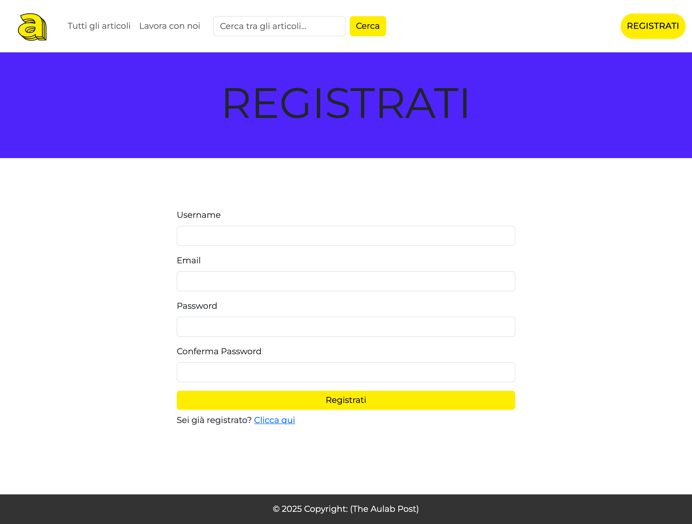

# The Aulab Post

**The Aulab Post** is an online news platform where registered users can submit, manage, and review articles.  
The project includes role-based access control (Admin, Revisor, Writer) and a full editorial workflow with fact-checking and article validation.

## Features

<p align="center">
  
  
</p>

<p align="center">
  
  
</p>

<p align="center">
  
  
</p>

<p align="center">
  
</p>

### User Accounts
- ✍️ Writers can register/login to submit articles.
- 📄 Articles are made of:
  - Title
  - Subtitle
  - Body content
  - Cover image
  - Predefined categories
- 🎯 Upon submitting an article, a confirmation message appears.

### Article Management
- 🆕 Writers can edit or delete their own articles.
- 🔄 If an article is modified, it returns to the revision process.
- 🧹 On image update or article deletion, old images are removed from storage.

### Browsing Articles
- 📰 Home displays the most recent articles (sorted newest to oldest).
- 🔎 Detailed article pages available.
- 📚 Search articles by:
  - Title
  - Subtitle
  - Category
  - Writer

### Fact-Checking Workflow
- 👥 Role system:
  - **Admin:** Full control, including managing tags and categories.
  - **Revisor:** Can review and accept or reject articles.
  - **Writer:** Can submit, edit, and manage personal articles.
- 🛠️ "Work with us" form for users to apply to become part of the team.
- 📊 Dedicated dashboard for admins to manage incoming team applications.
- ✅ Revisors have a dashboard to review articles with "Accept" or "Reject" actions.

### Tags and Categories
- 🏷️ Admins can create, edit, and delete tags and categories.
- 🔗 Many-to-Many relationship between Tags and Articles.
- 🧠 Tags are used in page meta-data for better SEO.

### Extras
- 🌐 Friendly URL slugs based on the article title.
- ⏱️ Automatic reading time estimation displayed in article detail pages.

## 🛠 Tech Stack

- PHP
- Laravel
- Eloquent
- Fortify
- Livewire
- MySQL
- Bootstrap

---

## ⚡ Installation & Local Setup

Follow these steps to clone and run the project locally:

```bash
# Clone the repository
git clone https://github.com/raven-dusky/the-aulab-post.git
cd the-aulab-post

# Install dependencies
composer install
npm install

# Setup environment configuration
cp .env.example .env
php artisan key:generate

# Configure database and mail settings in .env
# (Edit the following lines inside the .env file)
# DB_DATABASE=your_db
# DB_USERNAME=your_user
# DB_PASSWORD=your_password
# MAIL_...

# Run database migrations with seeding
php artisan migrate --seed

# Start local development server
php artisan serve

# In a separate terminal, compile assets with Vite
npm run dev
```
